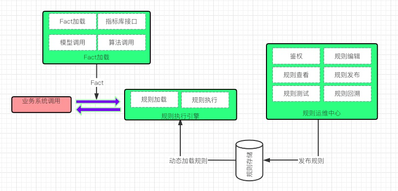

## 背景
目前风控事件需要运行很多规则，这些规则都是技术开发人员硬编码在系统中，如果有规则变动，需要开发人员修改规则并重新上线。规则引擎的建设，目的是想把规则的创建、维护、验证、发布抽离出来，交给业务同学，并且实现规则的动态加载发布。最终降低规则的引入、维护、验证成本。

## 规则引擎定位
#### 规则的运维中心
1. 主要面向规则开发同学
2. 负责规则、规则树、决策表和Fact等的创建、修改、测试、回溯、发布、存储。

#### 规则执行引擎
1. 只负责规则的执行，不负责规则所需数据的准备和加载，不依赖其他任何服务。
2. 只接受规则文件和包含规则所需数据的Fact。规则运行结果，也是会放到Fact中。
3. 应是一个独立的依赖包（放到atta-open中），以嵌入的方式，集成到需要执行规则的系统中。
4. 可动态更新规则集。

#### Fact
1. Fact是是一个数据模型，定义了规则所需数据字段的属性和规则执行结果字段的属性。
2. Fact是规则执行引擎的输入，规则执行之前需要把需要的数据加载到Fact中。
3. 规则执行引擎的结果也会放到Fact中，最终返回给调用方。

#### Fact的数据加载
1. Fact的数据加载应是一个groovy文件，这个groovy文件中包含了Fact各个字段的加载逻辑，如调用接口、数据转换等

## 规则引擎的构建
#### 规则运维中心
1. 登录、注册授权，规则数据鉴权。
2. Fact、规则、规则树、决策表的创建、修改
3. 规则复用、规则依赖、规则树
3. 规则存储
4. 规则测试验证
5. 规则发布：规则打包存储、分配版本号、通知执行引擎加载规则
6. 规则回溯：加载历史Fact，调用规则执行引擎，执行指定版本的规则。返回执行结果。
7. 规则标记
8. 规则双跑
9. 规则执行结果分析
10. 技术选型，以drools workbench为基础构建规则运维中心

#### 规则执行引擎
1. 规则调用：调用接口是统一通用的；参数包括：Fact，规则树名称，规则版本号；返回Fact，规则结果。
2. 规则动态加载：规则发布后，执行引擎自动拉取规则，动态加载
3. 依赖包：执行引擎做成一个公共组件，放到atta-open中。
4. 技术选型，drools规则引擎。

#### 规则数据加载与存储
1. groovy文件编辑（场景-规则树-规则-决策-指标-参数-数据接口-参数）、加载、执行
2. Fact历史记录存储
3. 扩展函数：主要用于数据格式的提取和处理，比如字符串、数组等格式转换、数据提取等。目的是降低对数据格式要求。
4. 指标数据接口调用，如名单库、标签库、离线实时计算出来的指标数据。
