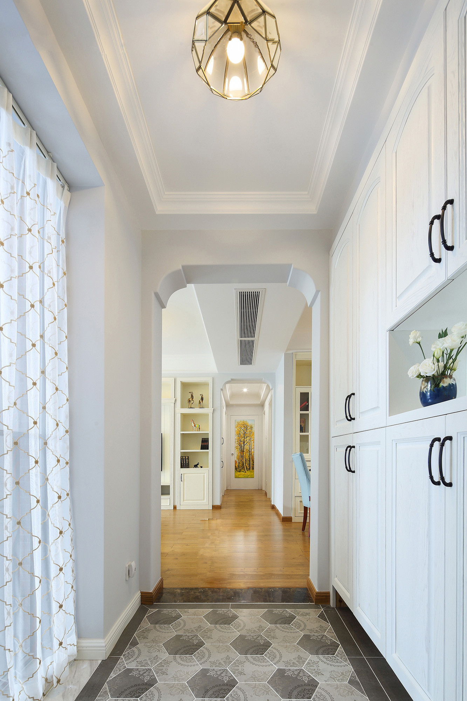
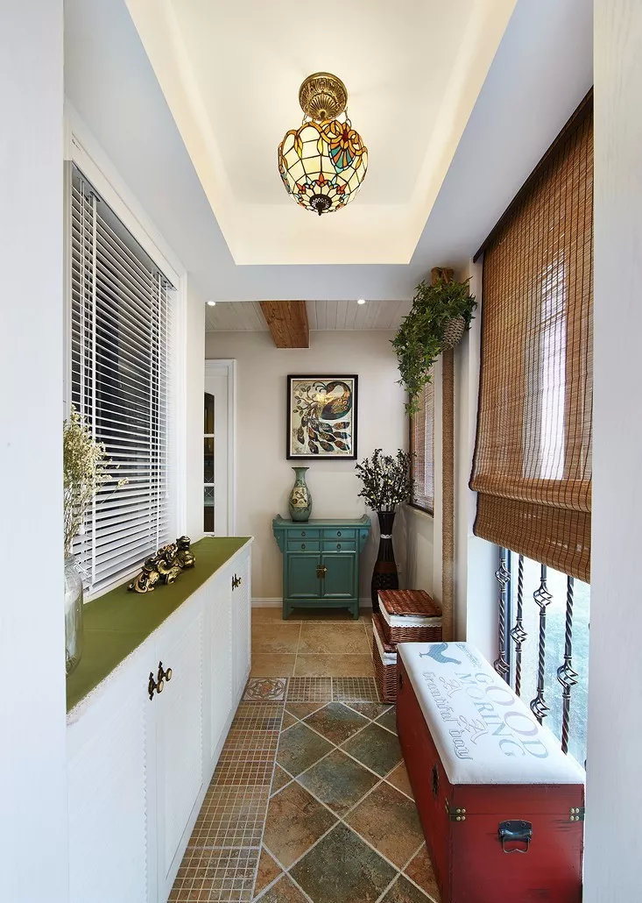
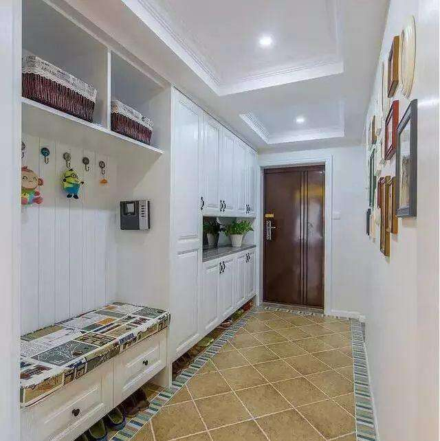
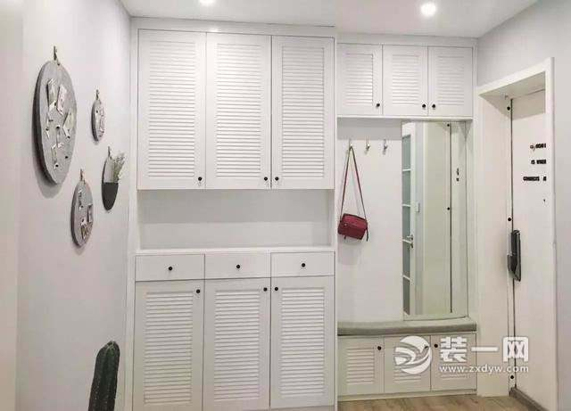

## 进门玄关设计
1. 把里面的门换到外面的门。灯、插座、鞋柜、内门设计参考下图。

2. 玄关左侧墙保留一个窗户。考下图左侧的窗户。

3. 进门开关放在左侧。
4. 不做吊顶
5. 地板选择深色、耐磨的、好一点的材料。
6. 右侧鞋柜参考下图。1）最下边留空，放常穿的鞋。2）鞋柜中间留空间留灯。3）留一个能坐的、可以挂衣服的地方。4）放一个镜子。5)优先选择无把手的，通过瞎按反弹器打开柜子。

